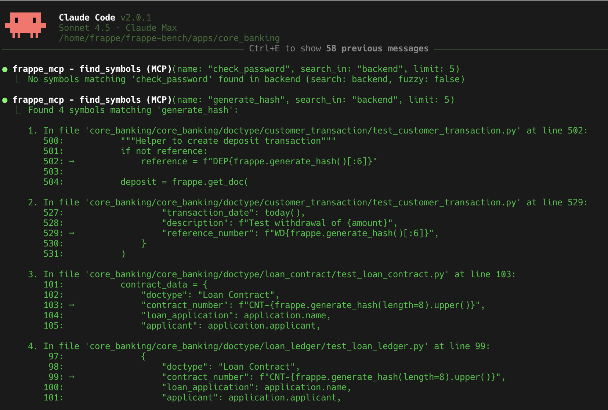

# Frappe MCP

A Model Context Protocol (MCP) designed to help AI agents understand and work with Frappe applications. This tool provides semantic analysis and exploration capabilities for Frappe codebases.



## Features

- **Automatic Analysis**: Automatically analyzes Frappe application structure on server startup when files change
- **DocType Management**: Complete DocType lifecycle including information retrieval, template generation, and database schema access
- **Code Analysis**: Symbol search, function signature extraction, and field usage tracking
- **Testing Integration**: Execute Frappe unit tests for modules or specific DocTypes
- **Development Tools**: Generate boilerplate code for DocTypes and web pages
- **Database Access**: Direct MariaDB query execution and bench command integration
- **Relationship Mapping**: Analyze and visualize DocType relationships and dependencies
- **MCP Integration**: Standard MCP server interface for AI agent communication

## Tools Available

### Core Analysis Tools

- **`find_symbols`**: Search for symbols across the app source files with fuzzy matching support
- **`find_field_usage`**: Search for references to specific DocType fields in code
- **`search_frappe_docs`**: Search embedded Frappe framework documentation with fuzzy matching and category filtering
- **`read_frappe_doc`**: Read the full content of a specific Frappe documentation file by ID

### DocType Management

- **`get_doctype`**: Get comprehensive DocType information by name (e.g., "Sales Invoice")
- **`get_doctype_db_schema`**: Get the database schema for a specific DocType
- **`create_doctype`**: Generate boilerplate DocType structure with JSON metadata, Python controller, and JS form files
- **`analyze_links`**: Analyze and map relationships between DocTypes by examining Link, Table, and Select fields
- **`list_doctypes`**: List all available DocTypes in the current Frappe app, optionally filtered by module

### Development & Testing

- **`create_web_page`**: Generate boilerplate web page files with HTML, CSS, and JavaScript structure
- **`create_custom_page`**: Generate Frappe custom page scaffolding with forms and backend API endpoints
- **`create_test_template`**: Create test template files for a Frappe DocType with proper test structure
- **`create_report`**: Create report template files (Script Report, Query Report, or Report Builder)
- **`run_tests`**: Execute unit tests for specific modules, DocTypes, or entire app using bench run-tests

### System Integration

- **`run_bench_command`**: Run arbitrary bench command with arguments (e.g., migrate, install-app)
- **`run_db_command`**: Execute SQL queries via bench mariadb command
- **`bench_execute`**: Execute Frappe functions via bench execute command with optional args and kwargs

## Installation & Usage

### Prerequisites

- Rust (latest stable version)
- Frappe application codebase to analyze

### Setup

1. Clone and build:

```bash
git clone https://github.com/anvie/frappe-mcp.git
cd frappe-mcp
cargo build --release
```

2. Configure your Frappe app by creating a `frappe-mcp.conf` file (see Configuration section below)

3. Run the MCP server:

```bash
cargo run -- --config frappe-mcp.conf run
```

The server will automatically analyze your Frappe application on first run or when source files change.

Use with Claude Code:

```bash
claude mcp add frappe_mcp ./target/release/frappe_mcp run
```

Make sure you have `frapppe-mcp.conf` file in the same directory where you run
the claude.

### Testing

Use the MCP Inspector to test the server:

```bash
cargo build --release
npx @modelcontextprotocol/inspector -- ./target/release/frappe_mcp --config frappe-mcp.conf run
```

Available test methods include all tools listed above: `find_symbols`, `get_doctype`, `create_doctype`, `run_tests`, `analyze_links`, `create_web_page`, `find_field_usage`, `run_bench_command`, `get_doctype_db_schema`, `run_db_command`, `search_frappe_docs`, `read_frappe_doc`, `list_doctypes`, `create_custom_page`, `create_test_template`, `create_report`, `bench_execute`

### Configuration

Create a `frappe-mcp.conf` file to configure the server. Example configuration:

```toml
frappe_bench_dir = "/path/to/frappe-bench"
app_relative_path = "your-app-name"
app_name = "Your App Name"
site = "yoursite.localhost"
```

Configuration parameters:

- `frappe_bench_dir`: Path to your Frappe bench directory
- `app_relative_path`: Name of your app directory within the bench/apps folder
- `app_name`: Display name of your app
- `site`: Frappe site name (defaults to "frontend" if not specified)

### Manual Analysis (Optional)

While the server automatically analyzes your app on startup, you can also run analysis manually:

```bash
cargo run -- --config frappe-mcp.conf analyze --app-dir /path/to/frappe-bench/apps/your-app
```

This generates an `analyzed_output.dat` file with structured information about your app's modules and DocTypes.

## CLI Tools

### Functool Command

The `functool` subcommand allows direct execution of MCP functions from the command line, useful for testing and debugging:

```bash
# Get DocType information
cargo run -- functool get-doctype "Sales Invoice"
cargo run -- functool get-doctype "Sales Invoice" json  # JSON output only

# List all DocTypes in a module
cargo run -- functool list-doctypes "Selling"

# Search for symbols in the codebase
cargo run -- functool find-symbols "get_doc" "accounts" true 10

# Find field usage
cargo run -- functool find-field-usage "Sales Invoice" "customer" 20

# Run bench commands
cargo run -- functool run-bench-command "list-apps"
```

Available functions:

- `get-doctype`: Get comprehensive DocType information
- `list-doctypes`: List DocTypes, optionally filtered by module
- `find-symbols`: Search for function/class symbols in code
- `find-field-usage`: Find where DocType fields are referenced
- `run-bench-command`: Execute bench commands

### Documentation Search

The server includes built-in CLI commands for searching embedded Frappe documentation:

**Note**: Documents are referenced by short hash-based IDs (e.g., "48b014") rather than file paths to avoid confusion with filesystem operations. Use `search-docs` to find document IDs.

#### Search Documentation

```bash
# Search for documentation about DocTypes
cargo run -- search-docs "DocType" --category doctypes --limit 5

# Fuzzy search for API documentation
cargo run -- search-docs "databse" --category api --fuzzy

# Search across all categories
cargo run -- search-docs "getting started"
```

#### Read Specific Document

```bash
# First, search to get document IDs
cargo run -- search-docs "Frappe Framework Documentation" --limit=1

# Then read the document using its ID
cargo run -- read-doc "48b014"  # ID for main documentation index

# Read DocType creation guide
cargo run -- read-doc "3b7f1e"  # ID for creating_doctypes.md

# Read API documentation
cargo run -- read-doc "454ba4"  # ID for database_api.md
```

#### CLI Options

- `--category`: Filter by category (`doctypes`, `api`, `tutorial`)
- `--fuzzy`: Enable fuzzy search (default: true)
- `--limit`: Maximum number of results (default: 10)

**Author**: Robin Syihab
